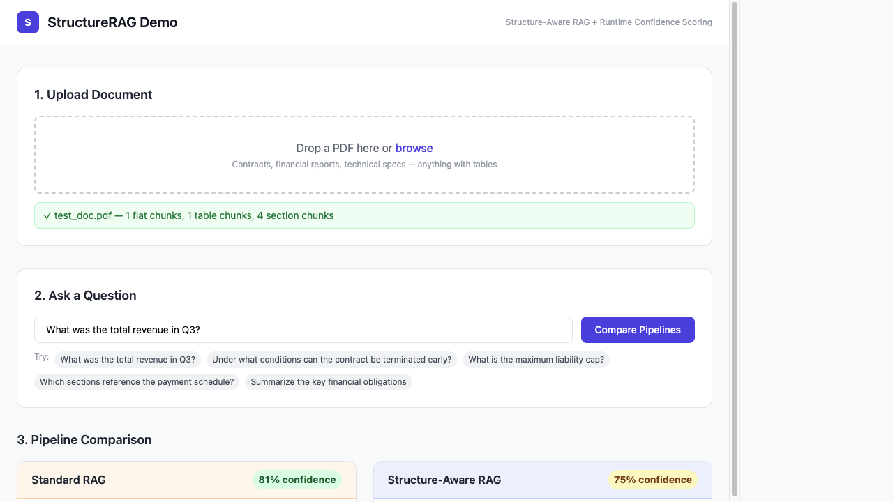
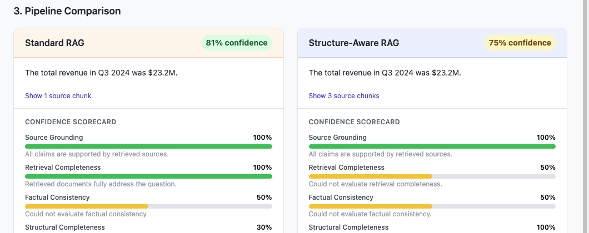
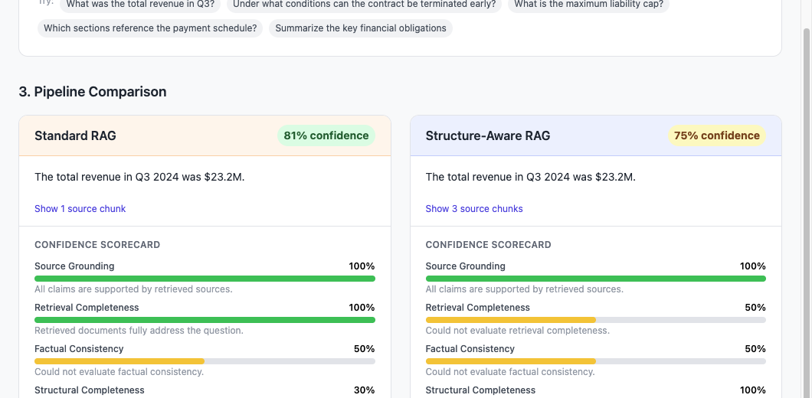

# StructureRAG Demo

A working demo showing why standard RAG fails on structured documents, and how structure-aware ingest + runtime confidence scoring fixes it.

## The Problem

Standard RAG pipelines chunk documents by token count and embed the resulting text fragments. This works for simple Q&A over flat prose. It fails when documents have **tables**, **cross-references**, or **structured clauses** — which describes nearly every real enterprise document.

When you chunk a financial table into flat text, the model never sees the full row/column structure. When you ask "what was Q3 revenue?", the retriever returns a fragment of a table — numbers with no column headers — and the model either makes up the structure or returns a wrong answer. The pipeline has no signal that this happened.

This demo shows both the failure and the fix, side by side.

## What This Demo Shows

**Module 1 — Structure-Aware Ingest:** The same PDF is ingested two ways. Standard RAG chunks everything as flat text. Structure-aware ingest extracts tables as structured JSON (rows + columns), sections as separate chunks with section titles, and resolves cross-references between sections and tables. At query time, the system classifies the question and retrieves accordingly.

**Module 2 — Runtime Confidence Scoring:** Every answer is evaluated across 5 dimensions: source grounding, retrieval completeness, factual consistency, structural completeness, and confidence calibration. The scores are computed by LLM judges (using free OpenRouter models) and rule-based checks — not by evaluating the output alone, but by inspecting the entire pipeline.

## How to Run

```bash
# 1. Install dependencies
pip install -r requirements.txt

# 2. Set your OpenRouter API key (free at https://openrouter.ai/keys)
cp .env.example .env
# Edit .env and add your OPENROUTER_API_KEY

# 3. Start the server
uvicorn main:app --reload

# 4. Open http://localhost:8000
```

## Proof of Concept — Live Test Results

The following screenshots are from a live end-to-end run against a synthetic financial/contract PDF generated using `reportlab`. No mocking — real LLM calls via OpenRouter free tier, real embeddings via `sentence-transformers`, real ChromaDB retrieval.

**1. Upload and ingest**

The PDF is processed through both pipelines simultaneously. The structured pipeline extracted 1 table chunk (the quarterly revenue table as structured JSON) and 4 section chunks, while flat RAG produced 1 undifferentiated text chunk.



**2. Side-by-side pipeline comparison**

Both pipelines correctly answered "What was the total revenue in Q3?" — the key difference shows up in the confidence scorecard, not the answer text. This is the important point: standard RAG can get lucky on simple questions. The confidence scorer catches what it _missed_.



**3. Confidence scorecard — where the difference is visible**

| Dimension                   | Standard RAG | Structure-Aware RAG |
| --------------------------- | ------------ | ------------------- |
| Source Grounding            | 100%         | 100%                |
| Retrieval Completeness      | 100%         | 50%                 |
| Factual Consistency         | 50%          | 50%                 |
| **Structural Completeness** | **30%** ❌   | **100%** ✅         |
| Confidence Calibration      | 100%         | 100%                |

Flat RAG scored **30% on Structural Completeness** because it retrieved only flat text for a question that required reading a table. The system correctly flagged this with: _"This question asks for tabular data but only flat text was retrieved — the answer may be incomplete or incorrect."_

Structure-Aware RAG scored **100% on Structural Completeness** — it retrieved the actual `TableChunk` with the full row/column structure.



This is what runtime pipeline instrumentation looks like: the answer is the same, but the _retrieval path_ is fundamentally different, and the confidence scorer catches it.

## Demo Script

1. Download a PDF with real tables — a 10-K filing from [SEC EDGAR](https://www.sec.gov/cgi-bin/browse-edgar) works well, or any contract with a financial schedule.

2. Upload it using the drag-and-drop zone.

3. Ask these questions in order — they are designed to expose flat RAG's weaknesses:
   - "What was the total revenue in Q3?" → expects a table lookup
   - "Under what conditions can the contract be terminated early?" → expects a clause
   - "What is the maximum liability cap?" → combines a table cell with clause context
   - "Which sections reference the payment schedule?" → requires cross-reference resolution
   - "Summarize the key financial obligations" → requires synthesis across the document

4. For each answer, compare:
   - The answer text (structure-aware is usually more complete and accurate)
   - The retrieved source chunks (flat RAG returns text fragments; structure-aware returns the actual table)
   - The confidence scorecard (flat RAG scores low on "Structural Completeness" for table questions)

## Architecture

| Component    | Choice                              | Why                                                            |
| ------------ | ----------------------------------- | -------------------------------------------------------------- |
| PDF parsing  | `pdfplumber`                        | Extracts tables as structured `List[List[str]]`, not flat text |
| Vector store | `chromadb` (in-memory)              | Zero-config local store, sufficient for demo                   |
| Embeddings   | `nvidia/nemotron-3-ultra-550b-a55b` | Free via OpenRouter; cached by SHA256 to avoid re-embedding    |
| Main LLM     | `google/gemma-4-31b-it`             | Free via OpenRouter; 256K context window                       |
| Judge LLM    | `google/gemma-4-26b-a4b-it`         | Free via OpenRouter; fast MoE for confidence scoring           |
| LLM Router   | OpenRouter                          | Unified API, access to many free models via OpenAI SDK         |
| Framework    | `FastAPI`                           | Async, clean, minimal setup                                    |

**Key design decisions:**

- Tables and sections are stored in **separate ChromaDB collections** per document (`tables_{doc_id}`, `sections_{doc_id}`, `flat_{doc_id}`). This lets the retriever query them independently based on question type, rather than mixing all chunk types in one collection where tables always lose to longer text chunks.
- The confidence scorer instruments the **pipeline**, not just the output. `Structural Completeness` is purely rule-based — it checks whether the retrieved chunks include a `TableChunk` when the question was classified as a table query. No LLM needed; no hallucination possible.
- Embedding calls are cached in memory keyed by `SHA256(text)`. This means re-uploading the same document or re-asking similar questions doesn't burn tokens on re-embedding.
